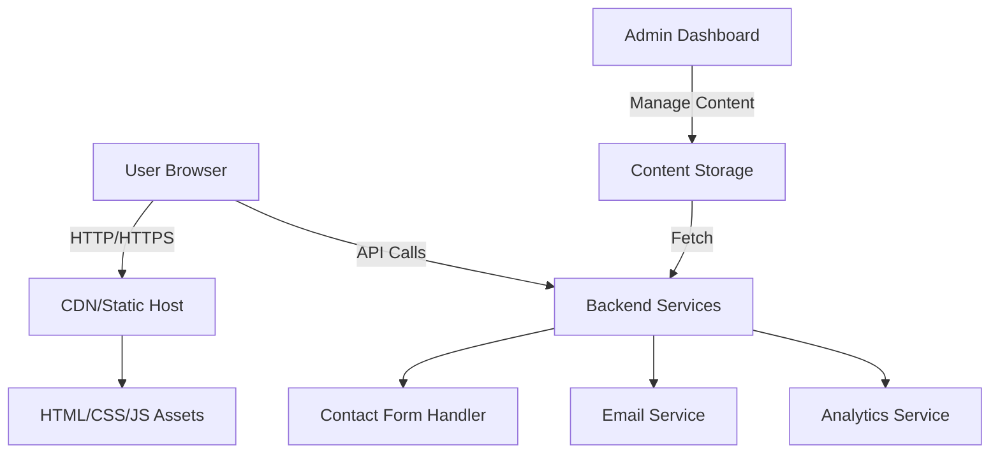
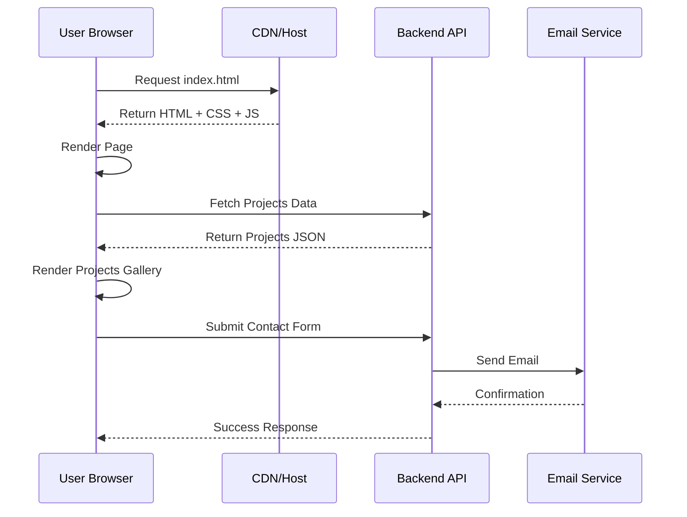
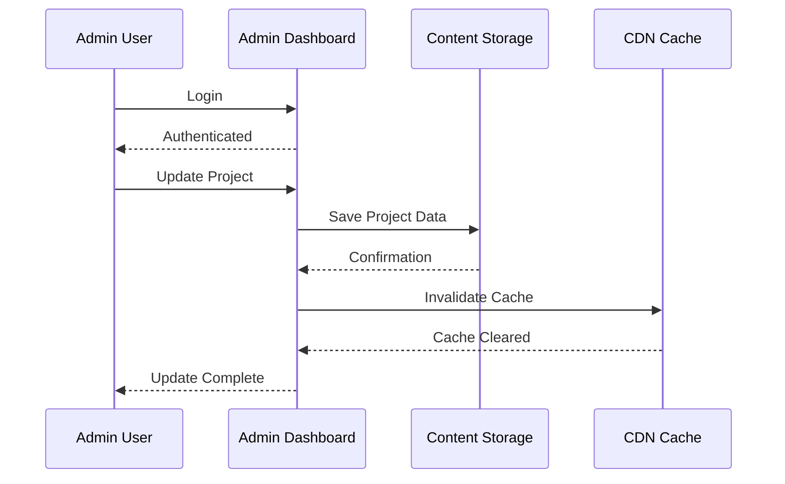

# Design Document: Portfolio Website

## Overview

A modern, responsive portfolio website that showcases a professional's work, skills, and experience. The website features a clean, minimalist design with smooth navigation, project galleries, contact forms, and social media integration. The system is built with a static-first approach for performance, with optional backend services for contact form handling and analytics. The architecture emphasizes fast load times, accessibility, and SEO optimization while maintaining a visually appealing user experience.

## Architecture

The portfolio website follows a client-server architecture with a static frontend and optional backend services:



## Sequence Diagrams

### User Browsing Portfolio



### Admin Content Update



## Components and Interfaces

### Component 1: Navigation Bar

**Purpose**: Provides site-wide navigation and branding

**Interface**:
```pascal
INTERFACE NavigationBar
  PROPERTIES
    logo: Image
    menuItems: Array<MenuItem>
    isSticky: Boolean
    isMobileMenuOpen: Boolean
  
  METHODS
    render(): HTMLElement
    toggleMobileMenu(): Void
    scrollToSection(sectionId: String): Void
    highlightActiveSection(sectionId: String): Void
END INTERFACE

STRUCTURE MenuItem
  label: String
  href: String
  icon: Image (optional)
END STRUCTURE
```

**Responsibilities**:
- Display logo and site title
- Provide navigation links to all major sections
- Handle mobile menu toggle
- Highlight current section during scroll
- Maintain sticky positioning on scroll

### Component 2: Hero Section

**Purpose**: Creates an engaging landing area with introduction and call-to-action

**Interface**:
```pascal
INTERFACE HeroSection
  PROPERTIES
    title: String
    subtitle: String
    backgroundImage: Image
    ctaButton: Button
    socialLinks: Array<SocialLink>
  
  METHODS
    render(): HTMLElement
    animateOnLoad(): Void
    handleCTAClick(): Void
END INTERFACE

STRUCTURE SocialLink
  platform: String (linkedin, github, twitter, etc.)
  url: String
  icon: Image
END STRUCTURE
```

**Responsibilities**:
- Display professional introduction
- Show background image or gradient
- Provide call-to-action button
- Display social media links
- Handle smooth scroll animations

### Component 3: Projects Gallery

**Purpose**: Showcase portfolio projects with filtering and detailed views

**Interface**:
```pascal
INTERFACE ProjectsGallery
  PROPERTIES
    projects: Array<Project>
    selectedCategory: String
    displayMode: String (grid, list)
    itemsPerPage: Integer
  
  METHODS
    render(): HTMLElement
    filterByCategory(category: String): Void
    loadMoreProjects(): Void
    openProjectDetail(projectId: String): Void
    toggleDisplayMode(): Void
END INTERFACE

STRUCTURE Project
  id: String
  title: String
  description: String
  category: String
  thumbnail: Image
  images: Array<Image>
  technologies: Array<String>
  liveUrl: String (optional)
  githubUrl: String (optional)
  startDate: Date
  endDate: Date (optional)
  featured: Boolean
END STRUCTURE
```

**Responsibilities**:
- Display projects in grid or list layout
- Filter projects by category
- Implement pagination or lazy loading
- Show project details in modal or dedicated page
- Display project metadata (technologies, dates, links)

### Component 4: Skills Section

**Purpose**: Display professional skills and competencies

**Interface**:
```pascal
INTERFACE SkillsSection
  PROPERTIES
    skillCategories: Array<SkillCategory>
    displayFormat: String (bars, tags, cards)
  
  METHODS
    render(): HTMLElement
    animateSkillBars(): Void
    filterByCategory(category: String): Void
END INTERFACE

STRUCTURE SkillCategory
  name: String
  skills: Array<Skill>
END STRUCTURE

STRUCTURE Skill
  name: String
  proficiency: Integer (0-100)
  yearsOfExperience: Integer
  endorsements: Integer (optional)
END STRUCTURE
```

**Responsibilities**:
- Display skills organized by category
- Show proficiency levels visually
- Animate skill bars on scroll into view
- Support multiple display formats

### Component 5: Contact Form

**Purpose**: Allow visitors to send messages directly from the portfolio

**Interface**:
```pascal
INTERFACE ContactForm
  PROPERTIES
    fields: Array<FormField>
    isSubmitting: Boolean
    submitStatus: String (idle, loading, success, error)
  
  METHODS
    render(): HTMLElement
    validateForm(): Boolean
    submitForm(): Promise<Response>
    resetForm(): Void
    displayMessage(message: String, type: String): Void
END INTERFACE

STRUCTURE FormField
  name: String
  type: String (text, email, textarea, select)
  label: String
  placeholder: String
  required: Boolean
  validation: String (regex pattern or validation rule)
END STRUCTURE
```

**Responsibilities**:
- Collect visitor information (name, email, message)
- Validate form inputs
- Submit to backend API
- Display success/error messages
- Prevent spam with rate limiting

### Component 6: Footer

**Purpose**: Provide site-wide footer with links and information

**Interface**:
```pascal
INTERFACE Footer
  PROPERTIES
    copyrightText: String
    quickLinks: Array<Link>
    socialLinks: Array<SocialLink>
    contactInfo: ContactInfo
  
  METHODS
    render(): HTMLElement
    updateYear(): Void
END INTERFACE

STRUCTURE ContactInfo
  email: String
  phone: String (optional)
  location: String (optional)
END STRUCTURE
```

**Responsibilities**:
- Display copyright information
- Provide quick navigation links
- Show social media links
- Display contact information
- Link to privacy policy and terms

## Data Models

### Project Model

```pascal
STRUCTURE Project
  id: String (UUID)
  title: String
  description: String
  longDescription: String
  category: String
  thumbnail: Image
  images: Array<Image>
  technologies: Array<String>
  liveUrl: String (optional)
  githubUrl: String (optional)
  startDate: Date
  endDate: Date (optional)
  featured: Boolean
  viewCount: Integer
  createdAt: DateTime
  updatedAt: DateTime
END STRUCTURE

VALIDATION RULES FOR Project
  - title must be non-empty and <= 100 characters
  - description must be non-empty and <= 500 characters
  - category must be one of predefined categories
  - thumbnail must be valid image URL
  - technologies array must not be empty
  - startDate must be valid date and <= today
  - endDate must be >= startDate if provided
  - liveUrl and githubUrl must be valid URLs if provided
END VALIDATION
```

### Contact Message Model

```pascal
STRUCTURE ContactMessage
  id: String (UUID)
  senderName: String
  senderEmail: String
  subject: String
  message: String
  status: String (new, read, archived)
  createdAt: DateTime
  ipAddress: String (for spam detection)
  userAgent: String (for analytics)
END STRUCTURE

VALIDATION RULES FOR ContactMessage
  - senderName must be non-empty and <= 100 characters
  - senderEmail must be valid email format
  - subject must be non-empty and <= 200 characters
  - message must be non-empty and <= 5000 characters
  - All fields are required
END VALIDATION
```

### User Profile Model

```pascal
STRUCTURE UserProfile
  id: String (UUID)
  name: String
  title: String
  bio: String
  profileImage: Image
  email: String
  phone: String (optional)
  location: String (optional)
  socialLinks: Array<SocialLink>
  skills: Array<Skill>
  experience: Array<Experience>
  education: Array<Education>
  theme: String (light, dark, auto)
  updatedAt: DateTime
END STRUCTURE

STRUCTURE Experience
  id: String
  company: String
  position: String
  description: String
  startDate: Date
  endDate: Date (optional)
  isCurrent: Boolean
END STRUCTURE

STRUCTURE Education
  id: String
  institution: String
  degree: String
  field: String
  graduationDate: Date
  description: String (optional)
END STRUCTURE
```

## Algorithmic Pseudocode

### Main Page Rendering Algorithm

```pascal
ALGORITHM renderPortfolioPage(userProfile, projects)
  INPUT: userProfile of type UserProfile, projects of type Array<Project>
  OUTPUT: renderedPage of type HTMLElement
  
  PRECONDITION
    userProfile is not null and contains valid data
    projects is a valid array (may be empty)
  END PRECONDITION
  
  SEQUENCE
    // Step 1: Initialize page structure
    page ← createHTMLElement("div", "portfolio-page")
    
    // Step 2: Render header and navigation
    header ← renderNavigationBar(userProfile)
    page.appendChild(header)
    
    // Step 3: Render hero section
    hero ← renderHeroSection(userProfile)
    page.appendChild(hero)
    
    // Step 4: Render about section
    about ← renderAboutSection(userProfile)
    page.appendChild(about)
    
    // Step 5: Render projects gallery
    gallery ← renderProjectsGallery(projects)
    page.appendChild(gallery)
    
    // Step 6: Render skills section
    skills ← renderSkillsSection(userProfile.skills)
    page.appendChild(skills)
    
    // Step 7: Render contact form
    contact ← renderContactForm()
    page.appendChild(contact)
    
    // Step 8: Render footer
    footer ← renderFooter(userProfile)
    page.appendChild(footer)
    
    // Step 9: Initialize event listeners
    initializeEventListeners(page)
    
    // Step 10: Apply animations and transitions
    applyAnimations(page)
    
    RETURN page
  END SEQUENCE
  
  POSTCONDITION
    renderedPage is a valid HTMLElement
    renderedPage contains all required sections
    All event listeners are properly attached
    Page is ready for display
  END POSTCONDITION
END ALGORITHM
```

### Project Filtering Algorithm

```pascal
ALGORITHM filterAndDisplayProjects(allProjects, selectedCategory, searchQuery)
  INPUT: allProjects of type Array<Project>
         selectedCategory of type String
         searchQuery of type String
  OUTPUT: filteredProjects of type Array<Project>
  
  PRECONDITION
    allProjects is a valid array
    selectedCategory is either empty or a valid category
    searchQuery is a valid string (may be empty)
  END PRECONDITION
  
  SEQUENCE
    // Step 1: Initialize result array
    filteredProjects ← empty Array<Project>
    
    // Step 2: Filter by category if specified
    IF selectedCategory is not empty THEN
      FOR EACH project IN allProjects DO
        IF project.category EQUALS selectedCategory THEN
          filteredProjects.add(project)
        END IF
      END FOR
    ELSE
      filteredProjects ← copy of allProjects
    END IF
    
    // Step 3: Filter by search query if provided
    IF searchQuery is not empty THEN
      searchResults ← empty Array<Project>
      FOR EACH project IN filteredProjects DO
        IF project.title contains searchQuery OR
           project.description contains searchQuery OR
           project.technologies contains searchQuery THEN
          searchResults.add(project)
        END IF
      END FOR
      filteredProjects ← searchResults
    END IF
    
    // Step 4: Sort by featured status and date
    sortByFeaturedAndDate(filteredProjects)
    
    // Step 5: Apply pagination
    paginatedProjects ← applyPagination(filteredProjects, itemsPerPage=6)
    
    RETURN paginatedProjects
  END SEQUENCE
  
  POSTCONDITION
    filteredProjects contains only projects matching criteria
    filteredProjects is sorted by featured status then date
    filteredProjects respects pagination limits
  END POSTCONDITION
  
  LOOP INVARIANTS
    - All processed projects have been checked against category filter
    - All processed projects have been checked against search query
    - Featured projects remain at the beginning of results
  END LOOP INVARIANTS
END ALGORITHM
```

### Contact Form Submission Algorithm

```pascal
ALGORITHM submitContactForm(formData)
  INPUT: formData of type ContactMessage
  OUTPUT: result of type SubmissionResult
  
  PRECONDITION
    formData is not null
    formData contains all required fields
    formData has been validated
  END PRECONDITION
  
  SEQUENCE
    // Step 1: Validate form data
    IF NOT validateContactMessage(formData) THEN
      RETURN SubmissionResult.Error("Invalid form data")
    END IF
    
    // Step 2: Check rate limiting
    clientIP ← getClientIPAddress()
    IF isRateLimited(clientIP) THEN
      RETURN SubmissionResult.Error("Too many requests. Please try again later.")
    END IF
    
    // Step 3: Sanitize input to prevent XSS
    formData ← sanitizeFormData(formData)
    
    // Step 4: Add metadata
    formData.ipAddress ← clientIP
    formData.userAgent ← getUserAgent()
    formData.createdAt ← getCurrentDateTime()
    
    // Step 5: Send to backend API
    response ← POST /api/contact (formData)
    
    // Step 6: Handle response
    IF response.status EQUALS 200 THEN
      // Step 7: Send confirmation email
      sendConfirmationEmail(formData.senderEmail, formData.senderName)
      RETURN SubmissionResult.Success("Message sent successfully")
    ELSE
      RETURN SubmissionResult.Error("Failed to send message. Please try again.")
    END IF
  END SEQUENCE
  
  POSTCONDITION
    IF result is Success THEN
      - Message is stored in database
      - Confirmation email is sent to sender
      - Admin notification email is sent
    END IF
    - Result contains appropriate message for user
  END POSTCONDITION
END ALGORITHM
```

### Lazy Loading Images Algorithm

```pascal
ALGORITHM lazyLoadImages(container)
  INPUT: container of type HTMLElement
  OUTPUT: void
  
  PRECONDITION
    container is a valid HTMLElement
    container may contain images with data-src attribute
  END PRECONDITION
  
  SEQUENCE
    // Step 1: Get all images with lazy-load class
    images ← container.querySelectorAll("img[data-src]")
    
    // Step 2: Create Intersection Observer
    observer ← createIntersectionObserver(
      callback: onImageVisible,
      options: {threshold: 0.1, rootMargin: "50px"}
    )
    
    // Step 3: Observe each image
    FOR EACH image IN images DO
      observer.observe(image)
    END FOR
    
    // Step 4: Define visibility callback
    PROCEDURE onImageVisible(entries)
      FOR EACH entry IN entries DO
        IF entry.isIntersecting THEN
          image ← entry.target
          image.src ← image.getAttribute("data-src")
          image.removeAttribute("data-src")
          observer.unobserve(image)
          image.classList.add("loaded")
        END IF
      END FOR
    END PROCEDURE
  END SEQUENCE
  
  POSTCONDITION
    - All images are observed for visibility
    - Images load when they enter viewport
    - Loaded images have "loaded" class applied
  END POSTCONDITION
  
  LOOP INVARIANTS
    - Each image is observed exactly once
    - Images not yet visible remain unloaded
  END LOOP INVARIANTS
END ALGORITHM
```

## Key Functions with Formal Specifications

### Function 1: validateContactMessage()

```pascal
FUNCTION validateContactMessage(message: ContactMessage): Boolean
```

**Preconditions:**
- `message` is not null
- `message` is of type ContactMessage

**Postconditions:**
- Returns `true` if and only if all validation rules pass
- Returns `false` if any validation rule fails
- No mutations to input message parameter
- Validation errors are logged for debugging

**Validation Rules:**
- `senderName` is non-empty and <= 100 characters
- `senderEmail` matches valid email regex pattern
- `subject` is non-empty and <= 200 characters
- `message` is non-empty and <= 5000 characters
- No HTML/script tags present (XSS prevention)

**Loop Invariants:** N/A (no loops in validation)

### Function 2: filterProjectsByCategory()

```pascal
FUNCTION filterProjectsByCategory(projects: Array<Project>, category: String): Array<Project>
```

**Preconditions:**
- `projects` is a valid array (may be empty)
- `category` is a valid string (may be empty for "all")
- All projects in array have valid category field

**Postconditions:**
- Returns array of projects matching the category
- If category is empty, returns all projects
- Returned array is sorted by featured status then date
- Original array is not modified
- Returned array may be empty if no matches found

**Loop Invariants:**
- All previously processed projects have been checked against category filter
- Featured projects remain at the beginning of results
- Projects maintain their relative order within category

### Function 3: renderProjectCard()

```pascal
FUNCTION renderProjectCard(project: Project): HTMLElement
```

**Preconditions:**
- `project` is not null and contains valid data
- `project.thumbnail` is a valid image URL
- `project.title` and `project.description` are non-empty

**Postconditions:**
- Returns a valid HTMLElement representing the project card
- Card contains all required project information
- Card is responsive and accessible
- Event listeners for interactions are attached
- No side effects on input project

**Loop Invariants:** N/A (no loops in rendering)

### Function 4: fetchUserProfile()

```pascal
FUNCTION fetchUserProfile(userId: String): Promise<UserProfile>
```

**Preconditions:**
- `userId` is a valid UUID string
- Backend API is accessible

**Postconditions:**
- Returns Promise that resolves to UserProfile object
- If successful: UserProfile contains all required fields
- If error: Promise rejects with descriptive error message
- Network errors are properly handled and logged
- Response is cached for performance

**Loop Invariants:** N/A (async operation)

### Function 5: smoothScrollToSection()

```pascal
FUNCTION smoothScrollToSection(sectionId: String, duration: Integer): Void
```

**Preconditions:**
- `sectionId` is a valid string matching an element ID
- `duration` is a positive integer (milliseconds)
- Element with matching ID exists in DOM

**Postconditions:**
- Page smoothly scrolls to target section
- Scroll completes within specified duration
- Navigation highlight updates to reflect current section
- No side effects on page content

**Loop Invariants:**
- Scroll position updates smoothly over time
- Animation frame updates maintain consistent timing

## Example Usage

### Basic Page Initialization

```pascal
SEQUENCE
  // Load user profile and projects
  userProfile ← fetchUserProfile("user-123")
  projects ← fetchProjects()
  
  // Render main page
  page ← renderPortfolioPage(userProfile, projects)
  
  // Mount to DOM
  document.body.appendChild(page)
  
  // Initialize interactions
  initializeScrollAnimations()
  initializeLazyLoading()
  initializeFormHandlers()
END SEQUENCE
```

### Project Filtering Example

```pascal
SEQUENCE
  // User selects category filter
  selectedCategory ← "Web Development"
  
  // Filter projects
  filteredProjects ← filterProjectsByCategory(allProjects, selectedCategory)
  
  // Update gallery display
  gallery ← document.querySelector(".projects-gallery")
  gallery.innerHTML ← ""
  
  FOR EACH project IN filteredProjects DO
    card ← renderProjectCard(project)
    gallery.appendChild(card)
  END FOR
  
  // Animate new cards
  animateNewCards(gallery)
END SEQUENCE
```

### Contact Form Submission Example

```pascal
SEQUENCE
  // User fills and submits form
  formElement ← document.querySelector("form.contact-form")
  formData ← new FormData(formElement)
  
  // Convert to ContactMessage
  message ← {
    senderName: formData.get("name"),
    senderEmail: formData.get("email"),
    subject: formData.get("subject"),
    message: formData.get("message")
  }
  
  // Show loading state
  submitButton ← formElement.querySelector("button[type='submit']")
  submitButton.disabled ← true
  submitButton.textContent ← "Sending..."
  
  // Submit form
  result ← submitContactForm(message)
  
  // Handle result
  IF result.isSuccess THEN
    displaySuccessMessage("Thank you! Your message has been sent.")
    formElement.reset()
  ELSE
    displayErrorMessage(result.errorMessage)
  END IF
  
  // Restore button state
  submitButton.disabled ← false
  submitButton.textContent ← "Send Message"
END SEQUENCE
```

## Correctness Properties

### Property 1: Data Integrity

**Universal Quantification**: For all projects in the portfolio, the project data must be valid and consistent.

```pascal
∀ project ∈ projects:
  (project.title ≠ ∅) ∧
  (project.category ∈ validCategories) ∧
  (project.startDate ≤ project.endDate ∨ project.endDate = ∅) ∧
  (project.thumbnail is valid image URL) ∧
  (project.technologies ≠ ∅)
```

### Property 2: Form Validation

**Universal Quantification**: All submitted contact messages must pass validation before being stored.

```pascal
∀ message ∈ submittedMessages:
  (validateContactMessage(message) = true) ⟹
  (message is stored in database)
```

### Property 3: Rendering Consistency

**Universal Quantification**: Every project in the filtered list must be rendered exactly once on the page.

```pascal
∀ project ∈ filteredProjects:
  (count of rendered cards for project) = 1
```

### Property 4: Navigation Accuracy

**Universal Quantification**: The active navigation item must always correspond to the current scroll position.

```pascal
∀ section ∈ pageSections:
  (isInViewport(section) = true) ⟹
  (navigationItem for section is highlighted)
```

### Property 5: Rate Limiting

**Universal Quantification**: No client IP should be able to submit more than N contact forms within a time window T.

```pascal
∀ clientIP ∈ clientIPs:
  (count of submissions from clientIP in time window T) ≤ N
```

## Error Handling

### Error Scenario 1: Network Failure

**Condition**: Backend API is unreachable or returns error status
**Response**: Display user-friendly error message, show retry button
**Recovery**: Implement exponential backoff retry logic, cache last successful data, allow offline viewing of cached content

### Error Scenario 2: Invalid Form Input

**Condition**: User submits contact form with invalid data
**Response**: Display inline validation errors highlighting problematic fields
**Recovery**: Prevent submission, guide user to correct errors, preserve valid data in form

### Error Scenario 3: Image Load Failure

**Condition**: Project thumbnail or gallery image fails to load
**Response**: Display placeholder image or fallback UI
**Recovery**: Retry loading with different image format, use CDN fallback, log error for monitoring

### Error Scenario 4: Rate Limiting

**Condition**: Client exceeds contact form submission limit
**Response**: Display message indicating rate limit exceeded with retry time
**Recovery**: Implement client-side countdown timer, show when user can submit again

### Error Scenario 5: XSS Attack Attempt

**Condition**: User submits form with HTML/script tags
**Response**: Sanitize input, reject submission if malicious content detected
**Recovery**: Log security event, display generic error message, implement CSRF token validation

## Testing Strategy

### Unit Testing Approach

**Test Framework**: Jest or Vitest

**Key Test Cases**:
- `validateContactMessage()` with valid and invalid inputs
- `filterProjectsByCategory()` with various category combinations
- `renderProjectCard()` with different project data
- `smoothScrollToSection()` with various section IDs
- Date validation and formatting functions
- URL validation for project links

**Coverage Goals**: Aim for 80%+ code coverage on utility functions and validators

### Property-Based Testing Approach

**Property Test Library**: fast-check (JavaScript/TypeScript)

**Properties to Test**:
- **Idempotence**: Filtering projects multiple times with same criteria returns same result
- **Commutativity**: Filtering by category then search returns same result as search then category
- **Consistency**: Rendered projects always match filtered project data
- **Validation Stability**: Valid data always passes validation, invalid data always fails
- **Pagination Correctness**: Total items across all pages equals total filtered items

**Example Property Test**:
```pascal
PROPERTY filteringIdempotence:
  ∀ projects, category:
    filterProjectsByCategory(projects, category) =
    filterProjectsByCategory(filterProjectsByCategory(projects, category), category)
```

### Integration Testing Approach

**Test Scenarios**:
- Full page load and rendering
- Navigation between sections
- Project filtering and search
- Contact form submission end-to-end
- Image lazy loading
- Responsive design on different screen sizes
- Accessibility compliance (keyboard navigation, screen readers)

**Tools**: Cypress or Playwright for end-to-end testing

## Performance Considerations

- **Image Optimization**: Use WebP format with fallbacks, implement lazy loading for below-fold images
- **Code Splitting**: Separate project gallery and contact form into lazy-loaded chunks
- **Caching Strategy**: Cache user profile and projects data with 1-hour TTL
- **CSS-in-JS**: Minimize CSS bundle size, use critical CSS inlining
- **Minification**: Minify all JavaScript and CSS in production
- **Target Metrics**: First Contentful Paint < 1.5s, Largest Contentful Paint < 2.5s, Cumulative Layout Shift < 0.1

## Security Considerations

- **Input Sanitization**: Sanitize all user inputs to prevent XSS attacks
- **CSRF Protection**: Implement CSRF tokens for form submissions
- **Rate Limiting**: Limit contact form submissions per IP address
- **HTTPS Only**: Enforce HTTPS for all connections
- **Content Security Policy**: Implement strict CSP headers
- **Dependency Scanning**: Regular security audits of npm dependencies
- **Environment Variables**: Store API keys and secrets in environment variables, never in code

## Dependencies

**Frontend**:
- React or Vue.js (optional, for component framework)
- Intersection Observer API (native browser API for lazy loading)
- Fetch API (native browser API for HTTP requests)
- CSS Grid and Flexbox (native browser APIs for layout)

**Backend** (optional):
- Node.js with Express or similar framework
- Email service (SendGrid, Mailgun, or similar)
- Database (MongoDB, PostgreSQL, or similar)
- Rate limiting middleware

**Development**:
- Build tool (Vite, Webpack, or similar)
- Testing framework (Jest, Vitest)
- Linter (ESLint)
- Formatter (Prettier)
- Version control (Git)
